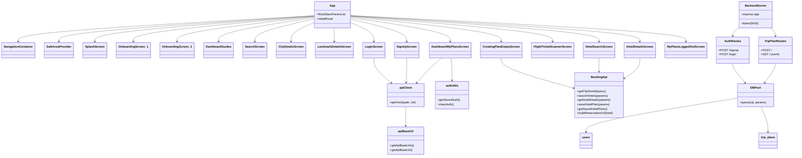
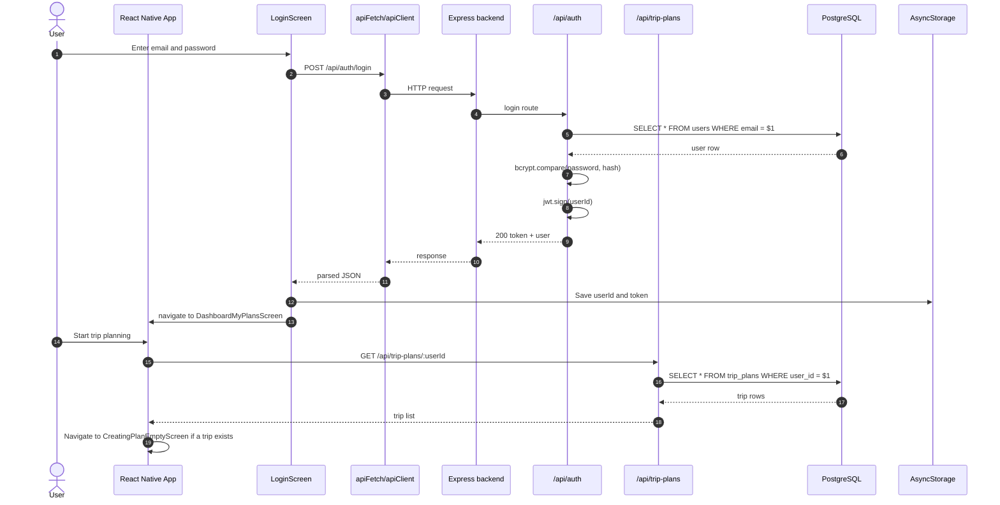
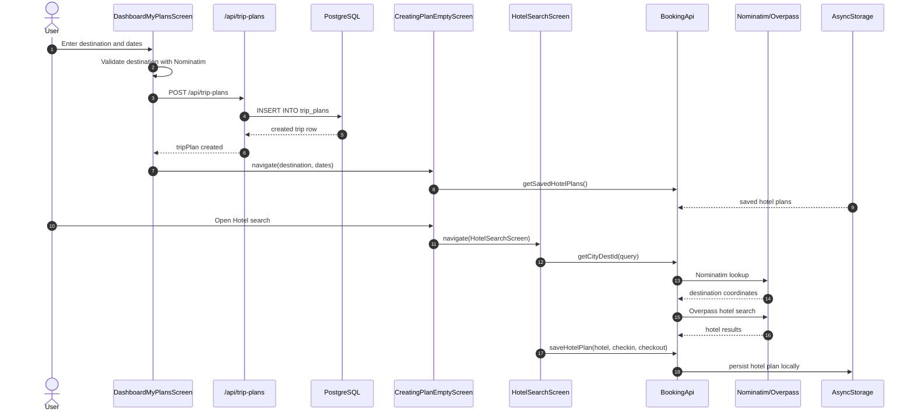
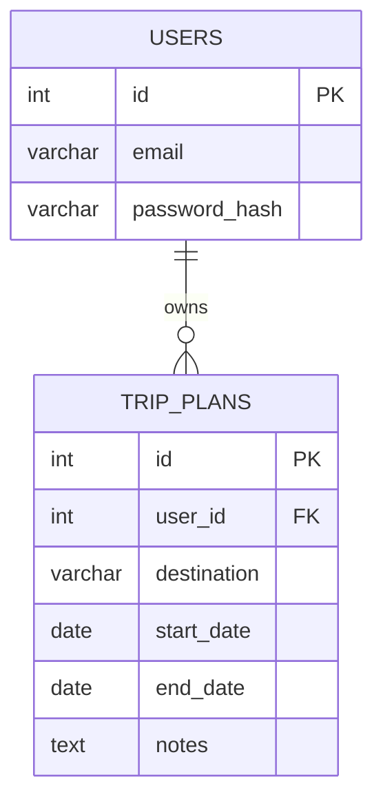

# TripMate System Diagrams

These diagrams are inferred from the current codebase in TripMateApp. They focus on the app shell, the auth and trip-planning flows, and the backend/database boundary.

## UML Class Diagram

## Sequence Diagram

## Trip Planning and Hotel Save Flow

## Entity-Relationship Diagram

## Notes

- The backend currently exposes only auth and trip-plan routes.
- Hotel saving is handled locally through AsyncStorage, not through the backend database.
- City and landmark discovery use public data sources through the `OpenSourcePlacesService` and the embedded map WebView.
