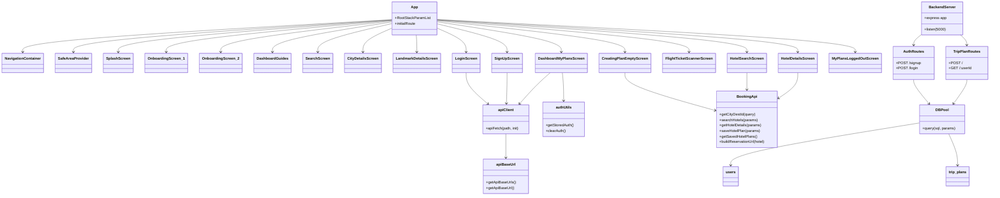

# TripMate UML Class Diagram

```mermaid
classDiagram
class App {
  +RootStackParamList
  +initialRoute
}

class NavigationContainer
class SafeAreaProvider

class DashboardGuides
class SearchScreen
class CityDetailsScreen
class LandmarkDetailsScreen
class LoginScreen
class SignUpScreen
class DashboardMyPlansScreen
class CreatingPlanEmptyScreen
class FlightTicketScannerScreen
class HotelSearchScreen
class HotelDetailsScreen
class MyPlansLoggedOutScreen
class SplashScreen
class OnboardingScreen_1
class OnboardingScreen_2

class apiClient {
  +apiFetch(path, init)
}

class apiBaseUrl {
  +getApiBaseUrls()
  +getApiBaseUrl()
}

class BookingApi {
  +getCityDestId(query)
  +searchHotels(params)
  +getHotelDetails(params)
  +saveHotelPlan(params)
  +getSavedHotelPlans()
  +buildReservationUrl(hotel)
}

class authUtils {
  +getStoredAuth()
  +clearAuth()
}

class BackendServer {
  +express app
  +listen(5000)
}

class AuthRoutes {
  +POST /signup
  +POST /login
}

class TripPlanRoutes {
  +POST /
  +GET /:userId
}

class DBPool {
  +query(sql, params)
}

class users
class trip_plans

App --> NavigationContainer
App --> SafeAreaProvider
App --> SplashScreen
App --> OnboardingScreen_1
App --> OnboardingScreen_2
App --> DashboardGuides
App --> SearchScreen
App --> CityDetailsScreen
App --> LandmarkDetailsScreen
App --> LoginScreen
App --> SignUpScreen
App --> DashboardMyPlansScreen
App --> CreatingPlanEmptyScreen
App --> FlightTicketScannerScreen
App --> HotelSearchScreen
App --> HotelDetailsScreen
App --> MyPlansLoggedOutScreen

LoginScreen --> apiClient
SignUpScreen --> apiClient
DashboardMyPlansScreen --> apiClient
DashboardMyPlansScreen --> authUtils
CreatingPlanEmptyScreen --> BookingApi
HotelSearchScreen --> BookingApi
HotelDetailsScreen --> BookingApi

apiClient --> apiBaseUrl
BackendServer --> AuthRoutes
BackendServer --> TripPlanRoutes
AuthRoutes --> DBPool
TripPlanRoutes --> DBPool
DBPool --> users
DBPool --> trip_plans
```

Open this file in a Mermaid-enabled preview to render it as a picture, or copy the code block into a Mermaid live editor.
